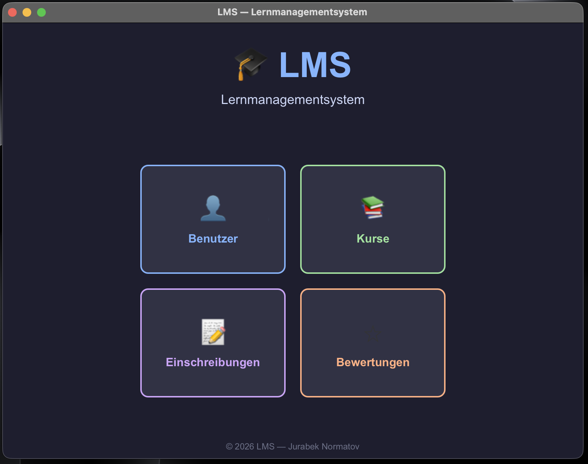
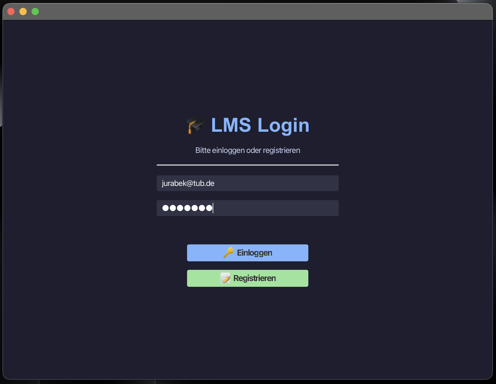
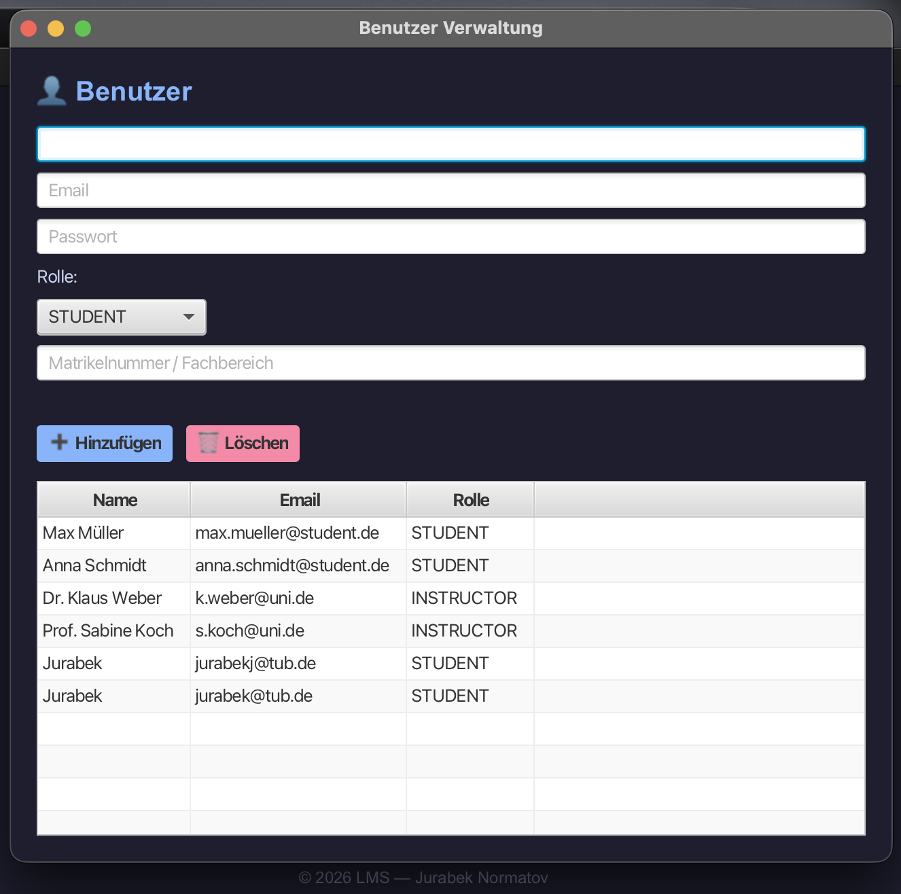
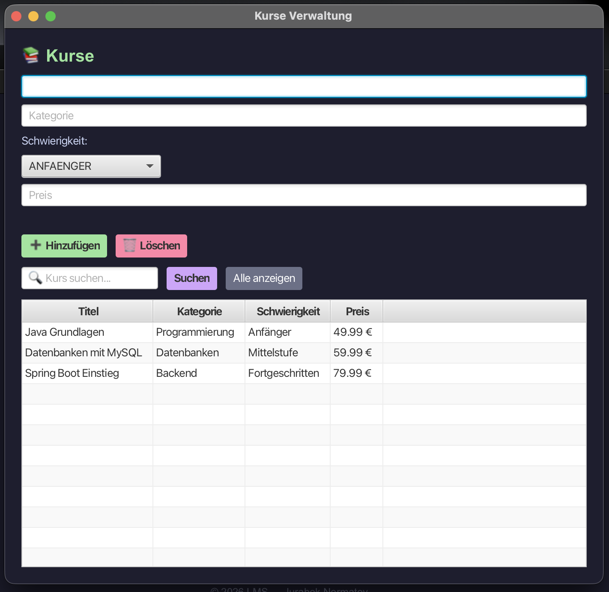

# LMS - Lernmanagementsystem

Desktop-Anwendung zur Verwaltung von Studenten, Dozenten, Kursen und Bewertungen.
Eigenprojekt zur Vertiefung von Java, JavaFX, JDBC und MySQL.

## Tech Stack

- Java 23
- JavaFX 21
- MySQL
- JDBC
- JUnit 5
- Maven

## Features

- Login mit Session-Management und Ablaufzeit
- Studenten und Dozenten verwalten
- Kurse mit Kategorie und Schwierigkeitsgrad verwalten
- Studenten in Kurse einschreiben
- Bewertungen mit Sterne-System erfassen
- Logging in Datei (Singleton Pattern)
- JUnit 5 Tests fuer UserManager und CourseManager

## Screenshots

## Setup

Voraussetzungen: Java 23, MySQL 8, Maven

Datenbank erstellen:
  CREATE DATABASE lms_db;

Umgebungsvariable setzen:
  export DB_PASSWORD=dein_passwort

Starten:
  mvn javafx:run

## Autor

Jurabek Normatov - Junior Java Developer - Berlin
GitHub: github.com/JurabekNormatov
